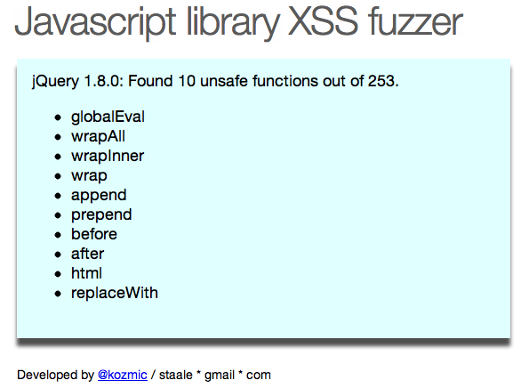

# Javascript that test jQuery for unsafe functions 

# About
This project executes all functions in a configurable Javascript framework with XSS attack strings as arguments. If an attck string executes, the function is marked as "unsafe". Unsafe functions should *never* be called with untrusted data as arguments without [encoding and/or validation](https://www.owasp.org/index.php/Abridged_XSS_Prevention_Cheat_Sheet), this will lead to one or more [XSS](https://www.owasp.org/index.php/XSS) vulnerabilities.

# Running the tests
* Start a HTTP server with the repository as server root.
 * Python: `python -m SimpleHTTPServer`
 * Ruby: `ruby -rwebrick -e'WEBrick::HTTPServer.new(:Port => 3000, :DocumentRoot => Dir.pwd).start'`
* Point your favorite browser (read Chrome) to `http://localhost:8000`

Tested in Chrome 20.0.1132.47.

# Example: Test result screenshot
Screenshot after fuzzing jQuery 1.8.0:

# Test results

## jQuery 1.8.0: 10 unsafe function out of 253.
* globalEval
* wrapAll
* wrapInner
* wrap
* append
* prepend
* before
* after
* html
* replaceWith

## jQuery 1.4.4: 10 unsafe function out of 236.
* globalEval
* wrapAll
* wrapInner
* wrap
* append
* prepend
* before
* after
* html
* replaceWith

## zepto.1.0rc1: 7 unsafe function out of 135
* replaceWith
* wrapAll
* html
* after
* prepend
* before
* append

# License

 This work is licensed under a <a rel="license" href="http://creativecommons.org/licenses/by-sa/3.0/">Creative Commons Attribution-ShareAlike 3.0 Unported License</a>.
